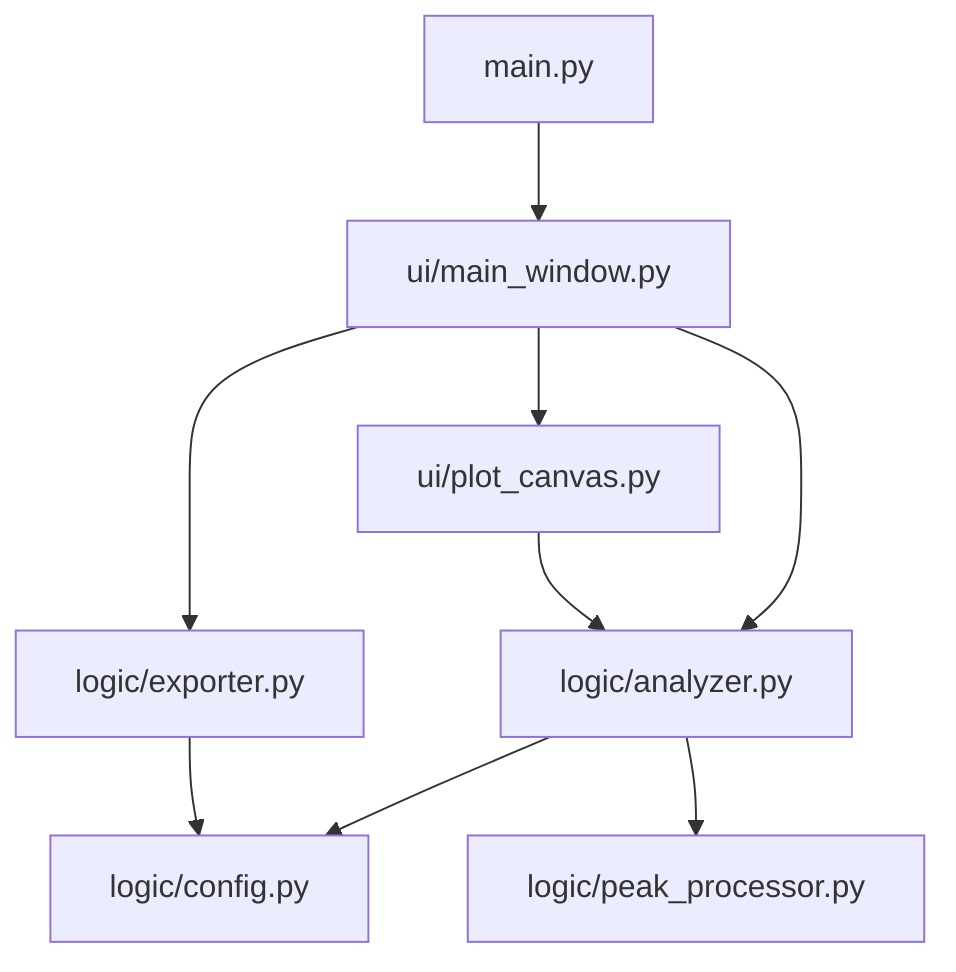
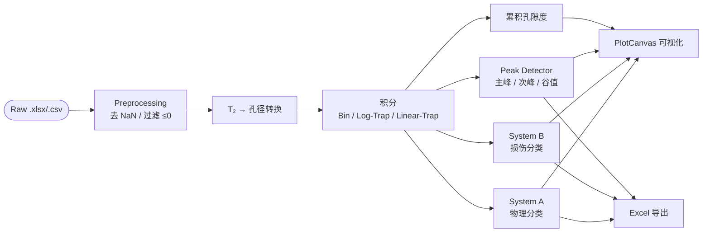

# liqinglq666-NMR-Analyzer v1.0

> 低场核磁共振（LF-NMR）T₂ 弛豫时间数据的孔隙结构分析桌面工具<br>
> *仅供学术交流使用*

---

## 项目结构

```
NMR-Pore-Distribution-Analyzer-Pro/
├── main.py
├── logic/
│   ├── config.py
│   ├── analyzer.py
│   ├── peak_processor.py
│   └── exporter.py
└── ui/
    ├── plot_canvas.py
    └── main_window.py
```

### 模块依赖



---

## 数据处理流程



---

## 核心公式

### 1. T₂ → 孔径转换

基于表面弛豫理论，多孔介质中流体的横向弛豫速率满足：

```math
\frac{1}{T_2}
= \frac{1}{T_{2,\text{bulk}}}
+ \rho_2 \cdot \frac{S}{V}
+ \frac{D\left(\gamma G T_E\right)^2}{12}
```

忽略体相弛豫和扩散项（短回波间距条件下），化简为：

```math
\frac{1}{T_2}
\approx \rho_2 \cdot \frac{S}{V}
= \rho_2 \cdot \frac{F_s}{r}
```

其中 $F_s$ 为孔隙形状因子（球形 $F_s=3$，柱形 $F_s=2$），由此导出线性标定关系：

```math
r\,[\text{nm}]
= \frac{\rho_2 F_s}{1} \cdot T_2
= \frac{100}{4.2} \cdot T_2\,[\text{ms}]
\approx 23.81\,T_2
```

标定锚点：$T_2^{*} = 4.2\,\text{ms} \Leftrightarrow r^{*} = 100\,\text{nm}$，表面弛豫率 $\rho_2 \approx 7.94\,\text{nm/ms}$

---

### 2. 孔径分布函数

定义信号振幅谱 $\{A_i\}$ 对应的孔径分布函数为：

```math
f(r)
= \frac{\mathrm{d}V_\text{pore}}{\mathrm{d}(\ln r)}
= A_i \cdot \frac{r_i}{\Delta r_i}
```

对数坐标下归一化孔径分布密度：

```math
\tilde{f}(r)
= \frac{f(r)}{\displaystyle\int_0^{+\infty} f(r)\,\mathrm{d}(\ln r)}
= \frac{A_i}{\displaystyle\sum_{j=1}^N A_j \cdot \Delta(\ln r_j)}
```

---

### 3. 积分模式

**Bin Summation**（默认，适用于对数等间距 ILT 反演结果）

```math
S^{(\text{bin})} = \sum_{i=1}^{N} A_i
```

**Log-Trapezoidal**（对数空间梯形积分，保持谱形不失真）

```math
S^{(\text{log})}
= \sum_{i=1}^{N-1}
\frac{A_i + A_{i+1}}{2} \cdot \Delta_i^{\log},
\qquad
\Delta_i^{\log} = \log_{10}\frac{t_{i+1}}{t_i}
```

**Linear Trapezoidal** ⚠（仅适用于线性等间距采样数据）

```math
S^{(\text{lin})}
= \sum_{i=1}^{N-1}
\frac{A_i + A_{i+1}}{2} \cdot (t_{i+1} - t_i)
```

**各类别相对孔隙度**

```math
\phi_k
= \frac{\left|S_k\right|}{\displaystyle\sum_j \left|S_j\right|},
\qquad
\sum_k \phi_k = 1
```

---

### 4. 孔隙分类体系 A（物理形态）

| 类别 | $T_2$ (ms) | $r$ (nm)           |
|---|---|--------------------|
| Gel pores | $[0,\ 0.42)$ | $[0,\ 10)$         |
| Transition pores | $[0.42,\ 4.2)$ | $[10,\ 100)$       |
| Capillary pores | $[4.2,\ 41.7)$ | $[100,\ 1000)$     |
| Air-voids | $[41.7,\ +\infty)$ | $[1000,\ +\infty)$ |

### 5. 孔隙分类体系 B（损伤潜势）

| 类别 | $T_2$ (ms)        | $r$ (nm)          |
|---|-------------------|-------------------|
| Harmless | $[0,\ 0.83)$      | $[0,\ 20)$        |
| Less-harmful | $[0.83,\ 2.08)$   | $[20,\ 50)$       |
| Harmful | $[2.08,\ 8.33)$   | $[50,\ 200)$      |
| More-harmful | $[8.33,\ +\infty)$ | $[200,\ +\infty)$ |

---

### 6. 累积孔隙度函数

定义累积孔隙体积分数（CDF）为：

```math
\Phi\!\left(T_2^{(n)}\right)
= \frac{\displaystyle\sum_{i=1}^{n} A_i}
       {\displaystyle\sum_{i=1}^{N} A_i},
\quad n = 1, \ldots, N
```

其导数即归一化孔径分布概率密度：

```math
p_n
= \frac{\mathrm{d}\Phi}{\mathrm{d}(\ln T_2)}
\Bigg|_{T_2^{(n)}}
\approx \frac{A_n}{\displaystyle\sum_{i=1}^{N} A_i}
```

---

### 7. 峰值检测算法

设信号序列 $\mathbf{A} = (A_1, A_2, \ldots, A_N)$，对应时间轴 $\mathbf{t} = (t_1, t_2, \ldots, t_N)$。

**Primary Peak**：限定域 $\Omega_1 = \{i : t_i \in [0, 10)\,\text{ms}\}$ 内全局最大值

```math
i_{\text{pri}}
= \underset{i\,\in\,\Omega_1}{\arg\max}\; A_i
```

**Secondary Peak**：限定域 $\Omega_2 = \{i : t_i \in (10, 1000]\,\text{ms}\}$ 内，满足局部极大值条件
$A_i > A_{i-1}$ 且 $A_i > A_{i+1}$ 的候选集 $\mathcal{L} \subset \Omega_2$ 中振幅最大者：

```math
i_{\text{sec}}
= \underset{i\,\in\,\mathcal{L}}{\arg\max}\; A_i
```

**Valley**：两峰间极小值，用于划分积分域

```math
i_{\text{v}}
= \underset{\{i\,:\,i_{\text{pri}} < i < i_{\text{sec}}\}}{\arg\min}\; A_i
```

```math
t_{\text{split}}
=
\begin{cases}
t_{i_{\text{v}}}, & \mathcal{L} \neq \varnothing \\
10\,\text{ms}, & \mathcal{L} = \varnothing\;(\text{fallback})
\end{cases}
```

**峰域面积与相对贡献**

```math
A_{\text{pri}} = \sum_{t_i < t_{\text{split}}} A_i,
\qquad
A_{\text{sec}} = \sum_{t_i \geq t_{\text{split}}} A_i
```

```math
R_k
= \frac{A_k}{A_{\text{pri}} + A_{\text{sec}}},
\quad
k \in \{\text{pri},\,\text{sec}\},
\qquad
R_{\text{pri}} + R_{\text{sec}} \equiv 1
```

---

## 快速启动

```bash
pip install -r requirements.txt
python main.py
```

**依赖：** Python ≥ 3.10 · PySide6 · NumPy · Pandas · Matplotlib · SciPy · openpyxl

> NumPy ≥ 2.0 使用 `numpy.trapezoid`，< 2.0 自动回退至 `numpy.trapz`

---

*liqinglq666 · 学术交流用途*
