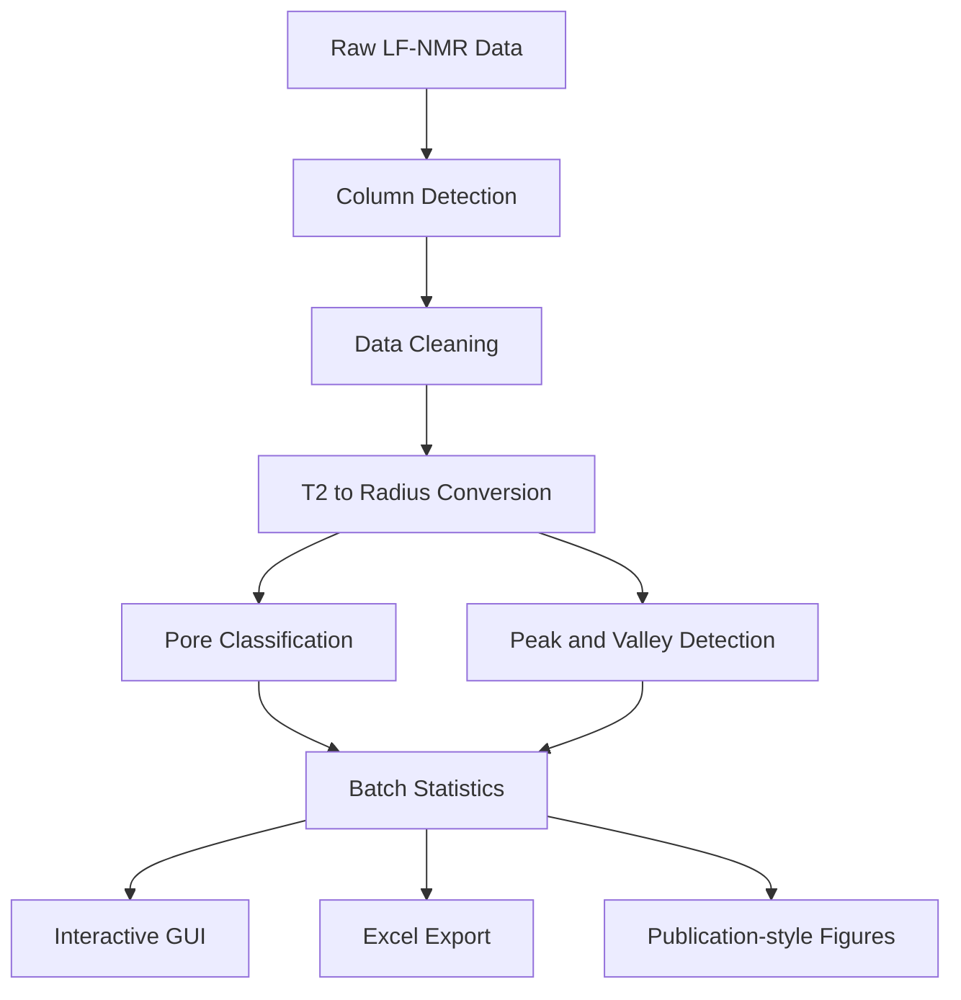

# NMR-Pore-Analyzer v2.1

> A research-oriented LF-NMR T₂ pore-structure analysis tool for cementitious and porous materials.  
> 面向低场核磁共振（LF-NMR）T₂ 弛豫谱的孔径转换、孔隙分级、峰谷识别、批量统计与论文级图表导出。  
> *Designed for academic research, reproducible data processing, and quantitative pore-structure interpretation.*

---

## 1. Research Motivation

The pore structure of cementitious materials strongly influences strength development, transport properties, durability, shrinkage, and damage evolution. Low-field nuclear magnetic resonance (LF-NMR) provides a non-destructive way to characterise pore-water distributions through the transverse relaxation time `T₂`. However, raw T₂ spectra exported from instruments are not directly suitable for rigorous academic interpretation: they often require careful unit conversion, pore-size classification, peak separation, batch comparison, and reproducible export for statistical analysis.

**NMR-Pore-Analyzer** was developed to bridge this gap between experimental LF-NMR output and publishable pore-structure indicators. The project is not only a plotting utility; it implements a complete research workflow that connects physical relaxation theory, calibrated T₂–radius conversion, numerical integration, peak/valley detection, damage-oriented pore classification, and Origin-ready data export.

This repository demonstrates the ability to translate a materials-science problem into a robust computational tool, combining:

- porous-media physical modelling;
- cement-based material pore classification logic;
- numerical integration and signal-processing algorithms;
- data cleaning for real instrument exports;
- desktop GUI engineering with PySide6;
- reproducible Excel/figure export for academic writing.

---

## 2. What This Project Solves

Typical LF-NMR post-processing involves several error-prone manual steps: selecting the correct T₂ column, converting T₂ to pore radius, dividing pores into meaningful ranges, identifying whether a second peak actually exists, and exporting results for comparison among mixtures. These operations are simple in concept but easy to make inconsistent across samples.

This tool standardises the workflow:

| Research task | Implementation in this project |
|---|---|
| T₂ spectrum cleaning | Numeric coercion, NaN removal, non-positive filtering, duplicated T₂-bin merging |
| T₂-to-radius conversion | Calibrated conversion using `4.2 ms ↔ 100 nm` |
| Pore classification | Dual systems: physical morphology and damage potential |
| Pore-fraction quantification | Bin summation, log-domain integration, and linear integration |
| Peak interpretation | Strict primary/secondary peak detection with valley-based area splitting |
| Batch comparison | Automatic multi-column sample processing |
| Academic export | Four-sheet Excel workbook and high-resolution figures |

---

## 3. Methodological Highlights

### 3.1 Physics-aware T₂–radius conversion

The conversion from transverse relaxation time to pore radius is grounded in surface relaxation theory rather than arbitrary axis scaling. For saturated porous media, the transverse relaxation rate can be expressed as:

```math
\frac{1}{T_2}
= \frac{1}{T_{2,\text{bulk}}}
+ \rho_2 \frac{S}{V}
+ \frac{D(\gamma G T_E)^2}{12}
```

When bulk relaxation and diffusion effects are negligible under short echo spacing conditions:

```math
\frac{1}{T_2}
\approx \rho_2 \frac{S}{V}
= \rho_2 \frac{F_s}{r}
```

The default calibration adopts:

```math
T_2^* = 4.2\,\text{ms}
\quad \Longleftrightarrow \quad
r^* = 100\,\text{nm}
```

Therefore:

```math
r\,[\text{nm}]
= \frac{100}{4.2}T_2\,[\text{ms}]
\approx 23.81T_2
```

The conversion factor is centralised in `logic/config.py`, making the tool easy to recalibrate for different material systems, surface relaxivities, or experimental assumptions.

### 3.2 Dual pore-classification systems

The project separates pore interpretation into two complementary systems.

**System A — Physical morphology**

| Class | T₂ range / ms | Radius range / nm | Interpretation |
|---|---:|---:|---|
| Gel | `[0, 0.42)` | `[0, 10)` | Gel-scale pores / fine pore structure |
| Transition | `[0.42, 4.2)` | `[10, 100)` | Transition pores |
| Capillary | `[4.2, 41.7)` | `[100, 1000)` | Capillary pores |
| Air-voids | `[41.7, +∞)` | `[1000, +∞)` | Large voids / entrapped air-related pores |

**System B — Damage potential**

| Class | T₂ range / ms | Radius range / nm | Interpretation |
|---|---:|---:|---|
| Harmless | `[0, 0.83)` | `[0, 20)` | Fine pores with limited damage potential |
| Less-harmful | `[0.83, 2.08)` | `[20, 50)` | Mildly harmful pores |
| Harmful | `[2.08, 8.33)` | `[50, 200)` | Pores associated with transport/durability risk |
| More-harmful | `[8.33, +∞)` | `[200, +∞)` | Coarse pores and connected voids |

This dual-system design allows one dataset to support both microstructural interpretation and durability-oriented discussion.

### 3.3 Boundary-aware integration

The tool provides three integration strategies:

| Mode | Best use case | Mathematical form |
|---|---|---|
| Bin Summation | Discrete LF-NMR inversion spectra; recommended default | `S_k = Σ A_i` |
| Log-domain Integration | Log-spaced T₂ spectra treated as continuous curves | `S_k = ∫ A d(log10 T₂)` |
| Linear Integration | Linearly sampled T₂ spectra | `S_k = ∫ A dT₂` |

For log-domain and linear-domain integration, class boundaries are interpolated before integration. This avoids a common numerical error: losing area when a pore-class threshold falls between two measured T₂ points.

### 3.4 Strict peak and valley detection

Peak detection is intentionally conservative. The program does **not** report a secondary peak simply because high-T₂ tail data exist. A secondary peak must be a strict local maximum within `(10, 1000] ms`:

```math
A_i > A_{i-1}
\quad \text{and} \quad
A_i > A_{i+1}
```

The valley between two peaks is also treated carefully. If a true local minimum exists, it is used as the splitting boundary. If not, the program falls back to `T₂ = 10 ms` and explicitly marks the result as `Fallback = Yes`, so the analyst can distinguish measured morphology from rule-based segmentation.

This design reduces false interpretation of monotonic tails as secondary pores and makes peak-ratio statistics more defensible in academic writing.

---

## 4. Software Architecture

```text
NMR-Pore-Analyzer/
├── main.py                    # Application entry point
├── requirements.txt           # Runtime dependencies
├── requirements-dev.txt       # Test dependencies
├── logic/
│   ├── config.py              # Physical constants, thresholds, aliases, version metadata
│   ├── analyzer.py            # Data loading, cleaning, conversion, classification
│   ├── peak_processor.py      # Primary/secondary peak and valley detection
│   └── exporter.py            # Research-style Excel workbook export
├── ui/
│   ├── main_window.py         # Main PySide6 desktop interface
│   ├── main_window_safe.py    # Safe QThread lifecycle wrapper
│   └── plot_canvas.py         # Matplotlib plotting canvas
└── tests/
    ├── conftest.py            # Project-path setup for pytest
    └── test_core_logic.py     # Core logic regression tests
```



The project intentionally separates scientific logic from GUI code. The computational modules can therefore be tested independently from the desktop interface, which improves maintainability and research reproducibility.

---

## 5. Installation and Usage

### 5.1 Install runtime dependencies

```bash
pip install -r requirements.txt
```

### 5.2 Run the desktop application

```bash
python main.py
```

### 5.3 Run tests

```bash
pip install -r requirements-dev.txt
pytest -q
```

Runtime dependencies:

```text
PySide6
numpy
pandas
openpyxl
xlrd
matplotlib
scipy
```

Supported input formats:

- `.xlsx` through `openpyxl`;
- `.xls` through `xlrd`;
- `.csv` through `utf-8-sig` first, then `gbk` fallback for Chinese instrument exports.

---

## 6. Input Data Format

The file should contain one T₂ column and one or more signal/amplitude columns.

Example:

| T2(ms) | Mix-1 | Mix-2 | Mix-3 |
|---:|---:|---:|---:|
| 0.01 | 12.3 | 11.9 | 13.1 |
| 0.02 | 15.6 | 14.8 | 15.2 |
| 0.05 | 18.2 | 17.1 | 19.0 |
| ... | ... | ... | ... |

The program recognises common English and Chinese headers, including:

- T₂ axis: `T2`, `T2(ms)`, `T₂(ms)`, `time(ms)`, `relaxation time`, `弛豫时间`, `弛豫时间/ms`;
- amplitude axis: `amplitude`, `signal`, `intensity`, `dv/dr`, `幅值`, `信号强度`, `孔隙度`, `增量孔隙度`.

If multiple amplitude columns are present, each column is analysed as an independent mixture/sample.

---

## 7. Processing Workflow


The workflow is designed to make every processing assumption visible and reproducible. This is especially important when LF-NMR results are used to support discussions about hydration, pore refinement, durability, or microstructure–property relationships.

---

## 8. Output Workbook

The exported Excel workbook contains four sheets:

| Sheet | Purpose |
|---|---|
| `Summary_Peak_Statistics` | Primary peak, secondary peak, valley position, peak-area ratio |
| `Pore_Classification_Ratios` | System A and System B pore-class proportions |
| `Cumulative_Curve_Data` | Radius and cumulative pore-distribution data for each sample |
| `Differential_Curve_Data` | Radius and incremental signal-fraction data for each sample |

The curve sheets are organised as paired columns per mixture, making them convenient for direct use in Origin, Excel, or other plotting software.

Figures can be exported as:

- PNG;
- PDF;
- SVG.

---

## 9. Academic Competence Demonstrated

This project is structured as a small but complete example of research-oriented scientific software development. It reflects several abilities that are valuable in materials science, civil engineering, and computational experimental analysis:

1. **Physical modelling ability**  
   The tool starts from LF-NMR surface relaxation theory and uses a calibrated T₂–radius relationship rather than treating the spectrum as a purely empirical curve.

2. **Materials interpretation ability**  
   The program links pore-radius ranges with physical pore morphology and damage-potential categories, enabling quantitative discussion of pore refinement and durability-related pore evolution.

3. **Numerical analysis awareness**  
   It distinguishes bin summation, log-domain integration, and linear integration, and corrects boundary interpolation issues that can otherwise distort class ratios.

4. **Signal-processing discipline**  
   Secondary peaks and valleys are identified using strict local-extrema logic, reducing false positives in pore-structure interpretation.

5. **Software engineering practice**  
   The code separates configuration, analysis logic, peak processing, export, plotting, and GUI layers, making the project easier to maintain and test.

6. **Research reproducibility**  
   The project includes explicit assumptions, test cases, deterministic processing rules, and structured Excel outputs suitable for thesis figures, journal-style plots, and experimental comparison tables.

---

## 10. Known Assumptions and Limitations

This tool is designed for transparent research analysis rather than universal black-box interpretation. Users should pay attention to the following assumptions:

1. The default conversion `4.2 ms ↔ 100 nm` is a calibration assumption. Different materials, pore fluids, or surface relaxivities may require recalibration.
2. The current workflow assumes positive T₂ values and positive signal amplitudes. NaN and non-positive values are removed during cleaning.
3. Bin Summation is recommended for most instrument-exported LF-NMR inversion spectra. Linear Integration should only be used for truly linear T₂ sampling.
4. Peak splitting is a rule-based quantitative descriptor. It should be interpreted together with raw spectra, mixture design, curing condition, and complementary microstructural evidence.
5. The software does not replace domain judgement; it makes the assumptions explicit so that the analysis can be reviewed, repeated, and defended.

---

## 11. Version Notes

Current version: `v2.1.0`

Major improvements in this version:

- support for `.xlsx`, `.xls`, and `.csv` data files;
- robust English/Chinese column recognition;
- duplicated T₂-bin merging;
- boundary-aware log/linear integration;
- strict secondary-peak and valley detection;
- explicit fallback-valley flagging;
- four-sheet Excel workbook export;
- safer repeated analysis in the PySide6 GUI;
- pytest-based core logic regression tests.

---

## 12. Research Use Statement

NMR-Pore-Analyzer is intended for academic research, thesis data processing, and reproducible pore-structure analysis of porous materials. The project emphasises transparent assumptions, inspectable algorithms, and export formats that can be directly used in scientific writing.
