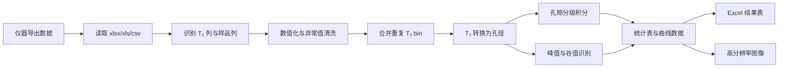

# NMR-Pore-Analyzer v2.1

> 这是我围绕低场核磁共振（LF-NMR）T₂ 弛豫谱数据处理建立的孔隙结构分析工具。  
> 做水泥基材料孔结构分析时，我发现仪器导出的原始 T₂ 数据离论文里真正能用的孔径分布、孔隙分级、峰值统计和对比图表还有一段距离，所以把自己常用的后处理步骤整理成了一个相对规范、可复现、也方便继续改的桌面程序。  
> 这个项目不是为了把界面做得多复杂，而是想把材料微结构表征里的物理假设、计算规则和结果输出流程尽量放到明面上。

---

## 1. 我为什么做这个项目

我最开始处理 LF-NMR 数据时，主要还是在 Excel 和 Origin 里来回整理。这个过程能做，但很容易乱：一组样品改一次列名，一组样品重新算一次比例，主峰和次峰的位置还要人工判断。样品少的时候还可以接受，样品一多，问题就出来了。

真正写论文时，我需要的不只是把 T₂ 谱画出来，而是希望这些数据能够回答几个具体问题：

1. 不同配合比或不同龄期下，孔径分布到底是细化了还是粗化了？
2. 凝胶孔、过渡孔、毛细孔和大孔的比例有没有明显变化？
3. 有害孔和无害孔比例能不能辅助解释耐久性差异？
4. 谱图里的高 T₂ 信号到底是真正的次峰，还是只是主峰后面的长尾？
5. 主峰、次峰和谷值能不能用同一套规则批量提取，而不是每张图靠肉眼判断？
6. 处理后的数据能不能直接进入论文绘图和结果分析环节？

所以这个工具本质上是从我的实验数据处理需求里长出来的。它不追求把所有功能都做满，而是先把 LF-NMR 孔结构分析中最常用、最容易出错的几个步骤固定下来，让后续分析更省事，也更容易复查。

---

## 2. 我希望它解决什么问题

这个项目主要解决的是“从仪器数据到论文结果”之间的后处理断层。

| 我在处理数据时遇到的问题 | 程序里的处理方式 |
|---|---|
| 仪器文件格式不统一 | 支持 `.xlsx`、`.xls`、`.csv`，并兼容中英文表头 |
| 多个样品列手动整理麻烦 | 自动识别 T₂ 列和多个样品信号列 |
| T₂ 谱本身不够直观 | 根据标定关系转换为等效孔径分布 |
| 孔隙分类每次手动算容易不一致 | 固定输出两套孔隙分类体系 |
| 积分方式不同会影响比例 | 提供 Bin、Log-domain、Linear 三种积分模式 |
| 高 T₂ 尾部容易被误判为次峰 | 次峰必须满足严格局部极大值条件 |
| 论文绘图需要反复整理数据 | 导出统计表、累积曲线、增量曲线和图像 |

我写这个工具时一直有一个想法：程序可以简单，但规则不能含糊。尤其是孔隙比例、峰值位置这类最后会进入论文讨论的指标，最好能做到每一步都知道是怎么算出来的。

---

## 3. 理论基础和计算假设

### 3.1 从 T₂ 弛豫时间到孔径

LF-NMR 用于孔结构分析的基础在于：孔隙水的横向弛豫时间 T₂ 与孔隙尺度之间存在联系。对于饱和多孔材料，横向弛豫速率一般可以表示为：

```math
\frac{1}{T_2}
= \frac{1}{T_{2,\text{bulk}}}
+ \rho_2 \cdot \frac{S}{V}
+ \frac{D(\gamma G T_E)^2}{12}
```

其中，`T₂` 是横向弛豫时间，`ρ₂` 是表面弛豫率，`S/V` 是孔隙表面积与体积之比。在短回波间隔条件下，如果体相弛豫和扩散弛豫的影响可以忽略，上式可以近似为：

```math
\frac{1}{T_2}
\approx \rho_2 \cdot \frac{S}{V}
= \rho_2 \cdot \frac{F_s}{r}
```

也就是说，在这个近似下，T₂ 越长，对应的孔隙尺度通常越大。为了把 T₂ 轴转换成更容易解释的孔径轴，我在程序里采用了下面这个标定关系：

```math
T_2 = 4.2\,\text{ms}
\quad \Longleftrightarrow \quad
r = 100\,\text{nm}
```

因此：

```math
r\,[\text{nm}]
= \frac{100}{4.2}T_2\,[\text{ms}]
\approx 23.81T_2
```

这个系数放在 `logic/config.py` 里，而不是藏在某个函数深处。后面如果材料体系、孔隙液或者表面弛豫率标定结果变化，可以直接改这里。对科研数据处理来说，我觉得这种“参数可追踪”比写死一个结果更重要。

### 3.2 两套孔隙分类体系

我在程序里保留了两套分类体系，因为我发现单一分类有时候不太够用：写微观结构演化时，需要凝胶孔、过渡孔、毛细孔这类描述；写耐久性或性能影响时，又更关心有害孔、无害孔比例。

#### System A：物理形态分类

| 孔隙类型 | T₂ 范围 / ms | 孔径范围 / nm | 我的理解 |
|---|---:|---:|---|
| Gel pores | `[0, 0.42)` | `[0, 10)` | 凝胶孔及非常细小的孔隙 |
| Transition pores | `[0.42, 4.2)` | `[10, 100)` | 介于凝胶孔和毛细孔之间的过渡孔 |
| Capillary pores | `[4.2, 41.7)` | `[100, 1000)` | 毛细孔，通常更影响传输行为 |
| Air-voids | `[41.7, +∞)` | `[1000, +∞)` | 大孔、气孔或明显缺陷孔 |

#### System B：损伤潜势分类

| 孔隙类型 | T₂ 范围 / ms | 孔径范围 / nm | 我的理解 |
|---|---:|---:|---|
| Harmless pores | `[0, 0.83)` | `[0, 20)` | 较细孔隙，对传输和损伤影响相对较小 |
| Less-harmful pores | `[0.83, 2.08)` | `[20, 50)` | 中小孔隙，可能产生一定影响 |
| Harmful pores | `[2.08, 8.33)` | `[50, 200)` | 与渗透、离子传输和耐久性劣化更相关 |
| More-harmful pores | `[8.33, +∞)` | `[200, +∞)` | 粗大孔、连通孔或缺陷孔 |

这两套分类不是为了显得复杂，而是为了让同一份数据可以从两个角度解释：一边看孔结构形态，一边看潜在性能影响。

---

## 4. 积分和峰值识别的处理思路

### 4.1 积分方式为什么没有只留一种

LF-NMR 反演谱通常是离散谱，但不同仪器导出的 T₂ 轴并不完全一样。有的更接近对数间隔，有的用户可能会拿线性采样的数据来处理。为了避免默认假设太死，我保留了三种模式：

| 积分模式 | 我建议的使用场景 | 计算含义 |
|---|---|---|
| Bin Summation | 默认推荐，用于多数仪器导出的离散反演谱 | 对区间内幅值直接求和 |
| Log-domain Integration | 当 T₂ 轴近似对数采样，并希望按连续曲线理解时使用 | 在 `log10(T₂)` 轴上积分 |
| Linear Integration | 仅当 T₂ 轴确实是线性采样时使用 | 在原始 T₂ 轴上积分 |

Bin Summation 的基本形式是：

```math
S_k = \sum_{i \in k} A_i
```

孔隙比例为：

```math
\phi_k = \frac{|S_k|}{\sum_j |S_j|}
```

这里有一个我后来特别注意的细节：如果分类边界刚好落在两个 T₂ 采样点之间，简单用 mask 截断会漏掉一小段面积。所以在 Log-domain 和 Linear 积分里，我加入了边界插值。这个改动不花哨，但会让不同孔径区间的比例更稳。

### 4.2 次峰识别为什么要保守

一开始处理谱图时，很容易看到高 T₂ 区间还有信号，就想把它当成次峰。但后来我觉得这样不够严谨，因为高 T₂ 信号可能只是主峰后的长尾，并不一定代表一个独立孔隙群。

所以我在程序里把主峰定义为 `[0, 10)` ms 区间内的全局最大值：

```math
i_{pri} = \arg\max_{i:T_{2,i}\in[0,10)} A_i
```

次峰则必须是 `(10, 1000]` ms 区间内的严格局部极大值：

```math
A_i > A_{i-1}
\quad \text{and} \quad
A_i > A_{i+1}
```

如果高 T₂ 区域没有严格局部极大值，程序就不输出次峰。这个规则比较保守，但我更愿意少解释一点，也不想把长尾误读成材料孔结构明显粗化。

### 4.3 谷值和 fallback 的处理

如果主峰和次峰都存在，程序会在两峰之间找局部极小值作为分割边界。如果真的有谷值，就用真实谷值；如果没有，就用 `T₂ = 10 ms` 作为 fallback boundary，并在结果中标出来。

我保留这个 fallback 标记，是因为我不希望程序只给一个“看起来完整”的结果，却不告诉使用者这个边界到底来自谱图本身，还是来自规则兜底。这个区别在写论文讨论时其实挺重要。

---

## 5. 代码结构

我没有把所有逻辑都堆在一个脚本里，而是把数据处理、峰值识别、结果导出、绘图和界面拆开。这样后面想改某一部分时不会牵一发动全身。

```text
NMR-Pore-Analyzer/
├── main.py                    # 程序入口
├── requirements.txt           # 运行依赖
├── requirements-dev.txt       # 测试依赖
├── logic/
│   ├── config.py              # 物理常数、孔隙阈值、列名别名、版本信息
│   ├── analyzer.py            # 数据读取、清洗、孔径转换、孔隙分类
│   ├── peak_processor.py      # 主峰、次峰、谷值识别
│   └── exporter.py            # Excel 科研结果表导出
├── ui/
│   ├── main_window.py         # PySide6 主界面
│   ├── main_window_safe.py    # 线程生命周期安全封装
│   └── plot_canvas.py         # Matplotlib 绘图画布
└── tests/
    ├── conftest.py            # pytest 路径配置
    └── test_core_logic.py     # 核心逻辑测试
```

整体数据流如下：



我把核心计算逻辑和界面分开，是因为界面可以变，但计算规则最好清楚、独立、能测试。这个项目后续如果继续扩展，也可以比较容易改成命令行批处理或 Web 版本。

---

## 6. 安装与运行

### 6.1 安装运行依赖

```bash
pip install -r requirements.txt
```

### 6.2 启动程序

```bash
python main.py
```

### 6.3 运行测试

```bash
pip install -r requirements-dev.txt
pytest -q
```

主要依赖包括：

```text
PySide6
numpy
pandas
openpyxl
xlrd
matplotlib
scipy
pytest
```

---

## 7. 输入数据格式

输入文件至少需要包含一列 T₂ 时间轴和一列信号幅值列。如果有多列样品数据，程序会把每一列当作一个独立样品进行批量分析。

示例：

| T2(ms) | Mix-1 | Mix-2 | Mix-3 |
|---:|---:|---:|---:|
| 0.01 | 12.3 | 11.9 | 13.1 |
| 0.02 | 15.6 | 14.8 | 15.2 |
| 0.05 | 18.2 | 17.1 | 19.0 |
| ... | ... | ... | ... |

程序支持常见英文和中文表头识别：

- T₂ 列：`T2`、`T2(ms)`、`T₂(ms)`、`time(ms)`、`relaxation time`、`弛豫时间`、`弛豫时间/ms`；
- 信号列：`amplitude`、`signal`、`intensity`、`dv/dr`、`幅值`、`信号强度`、`孔隙度`、`增量孔隙度`。

支持文件格式：

- `.xlsx`：使用 `openpyxl` 读取；
- `.xls`：使用 `xlrd` 读取；
- `.csv`：优先使用 `utf-8-sig`，失败后自动尝试 `gbk`，用于兼容中文仪器导出数据。

---

## 8. 输出结果

程序会导出四张 Excel 结果表：

| Sheet | 内容 |
|---|---|
| `Summary_Peak_Statistics` | 主峰、次峰、谷值、主峰/次峰面积比例 |
| `Pore_Classification_Ratios` | System A 与 System B 各类孔隙比例 |
| `Cumulative_Curve_Data` | 各样品孔径-累积分布曲线数据 |
| `Differential_Curve_Data` | 各样品孔径-增量信号分布数据 |

图像支持导出为：

- PNG；
- PDF；
- SVG。

这些输出主要服务于论文图表绘制、实验组间对比、龄期演化分析和微观结构讨论。

---

## 9. 实现过程中我重点处理的几个问题

这一部分不是功能清单，而是我在写这个工具时比较在意的几个细节。

### 9.1 不把 T₂ 谱只当成一条曲线

T₂ 谱本身只是实验反演结果，真正进入材料分析时，还需要和孔径、孔隙类型、材料性能联系起来。所以我没有只做绘图，而是把 T₂–孔径转换、孔隙分类和峰值统计都放进了同一套流程里。这样后面写结果分析时，数据不只是“好看的曲线”，而是可以继续讨论孔结构变化。

### 9.2 尽量减少手动判断

以前手动看峰值时，不同图之间很容易标准不一致。这个工具里我把主峰、次峰和谷值的判断规则固定下来。它不一定适合所有数据，但至少每一组样品都用同一套规则处理，后续如果要修改规则，也能知道改的是哪一步。

### 9.3 把不确定的地方标出来

我不太喜欢程序直接给出一个很完整但没有边界说明的结果。比如两峰之间没有真实谷值时，程序会用 fallback boundary，但也会把 fallback 标出来。这样在写论文时，我可以区分哪些结论来自谱图本身，哪些是为了统计连续性采用的规则。

### 9.4 给后续复查留空间

很多科研数据处理的问题不是当时看不出来，而是过一段时间回头看时忘了自己怎么处理的。所以我把阈值、标定系数、积分模式、输出表格都尽量显式化。这样以后复查数据、改论文图或者换材料体系时，不至于重新猜一遍当时的处理逻辑。

---

## 10. 适用场景

我主要将这个工具用于以下场景：

1. 水泥浆体、砂浆、混凝土、ECC 等水泥基材料的 LF-NMR 孔结构分析；
2. 不同胶凝材料组成、养护制度或龄期条件下的孔隙演化比较；
3. 孔径分布、累积分布和孔隙分类比例的批量统计；
4. 主峰/次峰变化与孔结构粗化、孔隙连通性或缺陷孔形成之间的关系分析；
5. 毕业论文、科研报告或论文初稿中的孔结构结果整理。

---

## 11. 我目前对这个工具边界的认识

为了避免把工具结果过度解释，我也明确保留以下边界说明：

1. 默认采用 `4.2 ms ↔ 100 nm` 的标定关系，不同材料体系应结合实际表面弛豫率进行校准；
2. 程序默认保留正 T₂ 与正信号幅值，NaN 和非正值会在清洗阶段删除；
3. 对大多数 LF-NMR 仪器反演谱，我更推荐使用 Bin Summation；Linear Integration 只适合线性采样 T₂ 轴；
4. 峰值分割是一种定量描述方法，不能脱离原始谱图、配合比、养护条件和其他微观测试结果单独解释；
5. 本工具强调透明、可复现和可审查，它不能替代研究者对材料机理的判断。

---

## 12. 版本说明

当前版本：`v2.1.0`

主要更新：

- 支持 `.xlsx`、`.xls`、`.csv` 数据文件；
- 增强中英文表头自动识别；
- 合并重复 T₂ bin，提高积分稳定性；
- 修正 Log / Linear 积分中的边界插值问题；
- 修正次峰误判问题，避免将单调尾部识别为次峰；
- 修正谷值识别逻辑，并显式标记 fallback valley；
- 导出四张科研结果表；
- 增加 PySide6 线程生命周期保护；
- 增加 pytest 核心逻辑测试。

---

## 13. 项目定位

NMR-Pore-Analyzer 是我围绕 LF-NMR 孔结构分析整理出的一个研究型数据处理项目。它的重点不是展示复杂技术栈，而是把我在处理实验数据时反复遇到的问题，用比较清楚的规则和代码固定下来。

如果后续继续完善，我更希望它往两个方向发展：一是把不同材料体系的标定关系做得更灵活；二是把批量数据和论文图表之间的连接做得更顺。