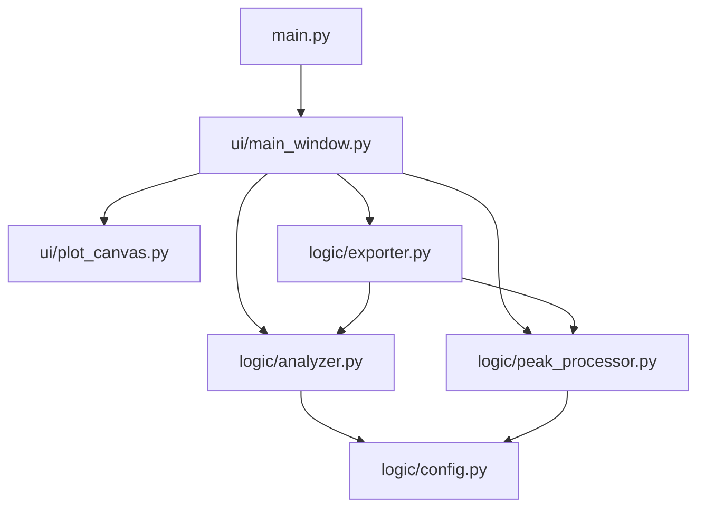

# NMR-Pore-Analyzer v2.1

> 低场核磁共振（LF-NMR）T₂ 弛豫时间数据的孔隙结构分析桌面工具。  
> 适用于 `.xlsx`、`.xls`、`.csv` 格式的 T₂ 反演谱数据分析。  
> *仅供学术交流和科研数据处理使用。*

---

## 1. 项目定位

NMR-Pore-Analyzer 用于将 LF-NMR T₂ 弛豫谱转换为孔径分布，并输出：

- T₂ → pore radius 转换结果；
- System A：物理形态分类；
- System B：损伤潜势分类；
- 主峰 / 次峰 / 谷值识别；
- 累积孔隙度曲线；
- Origin-ready Excel 数据表；
- 可直接用于论文绘图的 PNG / PDF / SVG 图像。

---

## 2. 项目结构

```text
NMR-Pore-Analyzer/
├── main.py
├── requirements.txt
├── logic/
│   ├── config.py
│   ├── analyzer.py
│   ├── peak_processor.py
│   └── exporter.py
└── ui/
    ├── plot_canvas.py
    └── main_window.py
```

### 模块关系



---

## 3. 安装与运行

```bash
pip install -r requirements.txt
python main.py
```

依赖包括：

```text
PySide6
numpy
pandas
openpyxl
xlrd
matplotlib
scipy
```

说明：

- `.xlsx` 使用 `openpyxl` 读取；
- `.xls` 使用 `xlrd` 读取；
- `.csv` 默认尝试 `utf-8-sig`，失败后自动尝试 `gbk`，方便读取中文仪器导出文件。

---

## 4. 数据格式要求

至少需要 1 列 T₂ 时间轴和 1 列幅值 / 信号列。

推荐格式：

| T2(ms) | Sample-1 | Sample-2 | Sample-3 |
|---:|---:|---:|---:|
| 0.01 | 12.3 | 11.9 | 13.1 |
| 0.02 | 15.6 | 14.8 | 15.2 |
| ... | ... | ... | ... |

程序会自动识别常见列名：

- T₂ 列：`T2`、`T2(ms)`、`T₂(ms)`、`time(ms)`、`弛豫时间`、`弛豫时间/ms` 等；
- 幅值列：`amplitude`、`signal`、`intensity`、`幅值`、`信号强度`、`孔隙度` 等。

如果存在多个幅值列，程序会自动批量分析每一列，并以列名作为样品名。

---

## 5. 数据处理流程

```mermaid
flowchart LR
    A([Raw xlsx/xls/csv]) --> B[Column detection]
    B --> C[Numeric cleaning]
    C --> D[Drop NaN and non-positive values]
    D --> E[Merge duplicated T2 bins]
    E --> F[T2 to radius conversion]
    F --> G[Integration and classification]
    G --> H[Peak and valley detection]
    H --> I[Plot and tables]
    I --> J[Excel / figure export]
```



---

## 6. 核心公式

### 6.1 T₂ → 孔径转换

基于表面弛豫理论，多孔介质中流体的横向弛豫速率满足：

```math
\frac{1}{T_2}
= \frac{1}{T_{2,\text{bulk}}}
+ \rho_2 \cdot \frac{S}{V}
+ \frac{D\left(\gamma G T_E\right)^2}{12}
```

在短回波间距、体相弛豫和扩散项可忽略时：

```math
\frac{1}{T_2}
\approx \rho_2 \cdot \frac{S}{V}
= \rho_2 \cdot \frac{F_s}{r}
```

本程序默认采用标定锚点：

```math
T_2^* = 4.2\,\text{ms}
\quad \Longleftrightarrow \quad
r^* = 100\,\text{nm}
```

因此：

```math
r\,[\text{nm}]
= \frac{100}{4.2}\,T_2\,[\text{ms}]
\approx 23.81\,T_2
```

---

## 7. 积分模式

程序提供三种积分模式。

### 7.1 Bin Summation（推荐）

适合常见 LF-NMR 仪器反演得到的离散谱：

```math
S_k = \sum_{i \in k} A_i
```

类别比例：

```math
\phi_k = \frac{|S_k|}{\sum_j |S_j|}
```

### 7.2 Log-domain Integration

在 `log10(T2)` 坐标下做梯形积分：

```math
S_k = \int_{\log_{10}T_{2,lo}}^{\log_{10}T_{2,hi}} A\,d(\log_{10}T_2)
```

程序会在分类边界处做线性插值，避免阈值落在两个采样点之间时漏面积。

### 7.3 Linear Integration

在线性 T₂ 坐标下做梯形积分：

```math
S_k = \int_{T_{2,lo}}^{T_{2,hi}} A\,dT_2
```

⚠ 仅当原始数据是线性等间距 T₂ 采样时建议使用。多数仪器反演谱是对数采样，默认仍推荐 Bin Summation。

---

## 8. 孔隙分类体系

### 8.1 System A：物理形态分类

| 类别 | T₂ 范围 / ms | r 范围 / nm |
|---|---:|---:|
| Gel | [0, 0.42) | [0, 10) |
| Transition | [0.42, 4.2) | [10, 100) |
| Capillary | [4.2, 41.7) | [100, 1000) |
| Air-voids | [41.7, +∞) | [1000, +∞) |

### 8.2 System B：损伤潜势分类

| 类别 | T₂ 范围 / ms | r 范围 / nm |
|---|---:|---:|
| Harmless | [0, 0.83) | [0, 20) |
| Less-harmful | [0.83, 2.08) | [20, 50) |
| Harmful | [2.08, 8.33) | [50, 200) |
| More-harmful | [8.33, +∞) | [200, +∞) |

---

## 9. 峰值与谷值识别

### 9.1 Primary Peak

主峰定义为低 T₂ 区间 `[0, 10)` ms 内的全局最大值：

```math
i_{pri} = \arg\max_{i:T_{2,i}\in[0,10)} A_i
```

### 9.2 Secondary Peak

次峰定义为 `(10, 1000]` ms 内的严格局部极大值：

```math
A_i > A_{i-1}
\quad \text{and} \quad
A_i > A_{i+1}
```

如果高 T₂ 区间只是单调尾部，程序不会强行生成次峰。

### 9.3 Valley

若存在主峰与次峰，则在两峰之间寻找严格局部极小值：

```math
i_v = \arg\min_{i_{pri}<i<i_{sec}} A_i
```

如果两峰之间不存在严格局部极小值，程序使用 `T2 = 10 ms` 作为 fallback boundary，并在表格中标记 `Fallback? = Yes`。

---

## 10. 导出内容

Excel 导出包含 4 张表：

| Sheet | 内容 |
|---|---|
| `Summary_Peak_Statistics` | 主峰、次峰、谷值、主/次峰面积比 |
| `Pore_Classification_Ratios` | System A 与 System B 各类别百分比 |
| `Cumulative_Curve_Data` | 每个样品的 Radius 与 Cumulative porosity 数据 |
| `Differential_Curve_Data` | 每个样品的 Radius 与 Incremental signal fraction 数据 |

图像可导出为：

- PNG
- PDF
- SVG

---

## 11. 注意事项

1. T₂ 数据必须为正值；幅值 / 信号也必须为正值。
2. 程序会自动删除 NaN 和非正值。
3. 重复 T₂ bin 会自动合并，幅值求和。
4. 默认标定关系为 `4.2 ms ↔ 100 nm`，如需更换材料体系的表面弛豫率，应修改 `logic/config.py` 中的 `RADIUS_FACTOR`。
5. 若数据没有低 T₂ 主峰窗口 `[0, 10)` ms 内的点，峰值分析会报错，说明数据范围不适合当前默认峰识别规则。

---

## 12. 版本说明

当前版本：`v2.1.0`

主要能力：

- 支持 `.xlsx` / `.xls` / `.csv`；
- 支持多样品列批量分析；
- 支持 Bin / Log / Linear 三种积分模式；
- 支持严格主峰、次峰和谷值识别；
- 支持四表 Excel 导出和图像导出。
