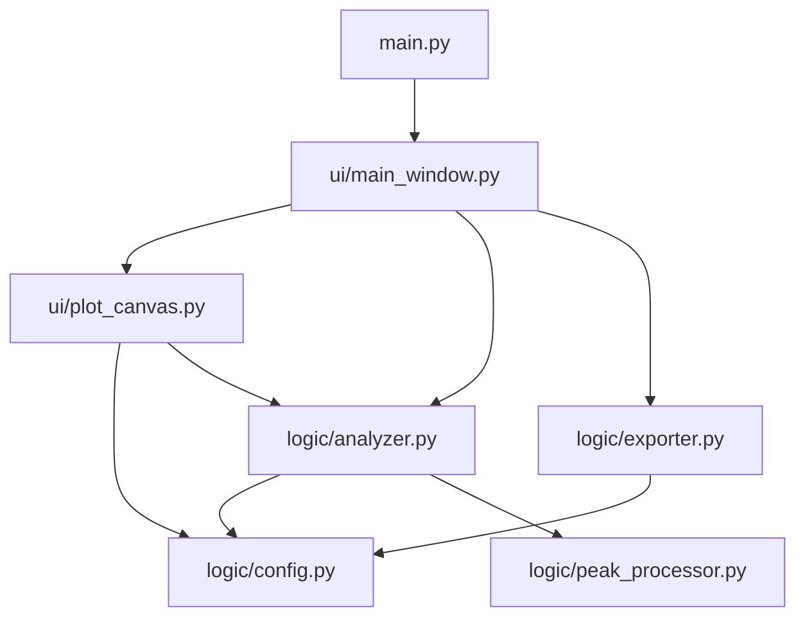
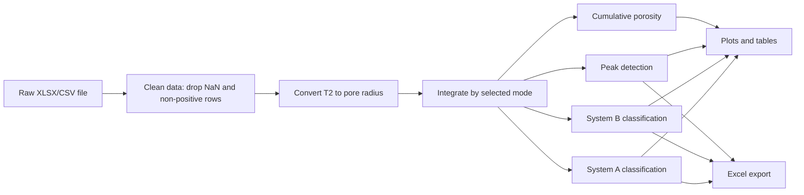

# liqinglq666-NMR-Analyzer

Desktop analysis tool for LF-NMR T2 relaxation data and pore-structure
characterisation. It supports multi-sample Excel/CSV files, pore classification,
peak analysis, scientific plots, and Excel report export.

This project is intended for academic research and data analysis workflows.

---

## Features

- Load `.xlsx`, `.xls`, and `.csv` NMR data files.
- Detect the T2 time column with flexible column-name matching.
- Analyse one or many sample columns in the same file.
- Convert T2 relaxation time to pore radius.
- Calculate pore-classification ratios with three integration modes:
  - Bin Summation
  - Log-domain Trapezoidal Integration
  - Linear Trapezoidal Integration
- Detect primary peaks, secondary peaks, and valley positions.
- Plot pore-size distribution and cumulative porosity curves.
- Export multi-sheet Excel reports for downstream analysis.

---

## Project Structure

```text
NMR-Pore-Analyzer/
|-- main.py
|-- requirements.txt
|-- logic/
|   |-- config.py
|   |-- analyzer.py
|   |-- peak_processor.py
|   `-- exporter.py
`-- ui/
    |-- plot_canvas.py
    `-- main_window.py
```

## Module Flow



## Data Processing Flow



---

## Installation

Python 3.10 or later is recommended.

```bash
pip install -r requirements.txt
```

## Run

```bash
python main.py
```

If PySide6 fails to load on Windows, reinstalling PySide6 in the active Python
environment usually resolves missing Qt DLL issues:

```bash
pip uninstall PySide6 PySide6_Addons PySide6_Essentials shiboken6
pip install -r requirements.txt
```

---

## Input Data Format

The input file should contain:

- one T2/time column
- one or more amplitude/signal columns

Recognised T2 column aliases include:

```text
time, t2, t_2, t2(ms), time(ms), ms, relaxation time
```

Recognised amplitude aliases include:

```text
amplitude, amp, intensity, signal, a, dv/dr, incremental
```

For multi-sample files, each non-time column is treated as a sample.

Example:

| T2(ms) | Sample_A | Sample_B |
|---:|---:|---:|
| 0.10 | 12.5 | 10.1 |
| 0.20 | 18.3 | 14.8 |
| 0.50 | 22.0 | 19.6 |

---

## Core Calculations

### T2 to Pore Radius

The default calibration anchor is:

```text
T2 = 4.2 ms  ->  r = 100 nm
```

The pore radius is calculated as:

```text
r (nm) = (100 / 4.2) * T2 (ms)
r (nm) ~= 23.81 * T2 (ms)
```

### Integration Modes

Bin Summation:

```text
S_bin = sum(A_i)
```

Log-domain Trapezoidal Integration:

```text
S_log = sum(0.5 * (A_i + A_i+1) * log10(t_i+1 / t_i))
```

Linear Trapezoidal Integration:

```text
S_linear = sum(0.5 * (A_i + A_i+1) * (t_i+1 - t_i))
```

Class ratio:

```text
ratio_k = abs(S_k) / sum(abs(S_j))
```

---

## Classification Systems

### System A: Physical Pore Morphology

| Class | T2 range (ms) | Radius range (nm) |
|---|---:|---:|
| Gel pores | [0, 0.42) | [0, 10) |
| Transition pores | [0.42, 4.2) | [10, 100) |
| Capillary pores | [4.2, 41.7) | [100, 1000) |
| Air voids | [41.7, +inf) | [1000, +inf) |

### System B: Damage Potential

| Class | T2 range (ms) | Radius range (nm) |
|---|---:|---:|
| Harmless | [0, 0.83) | [0, 20) |
| Less harmful | [0.83, 2.08) | [20, 50) |
| Harmful | [2.08, 8.33) | [50, 200) |
| More harmful | [8.33, +inf) | [200, +inf) |

---

## Peak Analysis

Primary peak:

- searched in the low-T2 window `[0, 10)` ms
- selected as the maximum amplitude in that window

Secondary peak:

- searched in the high-T2 window `[10, 1000)` ms
- selected as the dominant local maximum

Valley:

- selected as the minimum amplitude between the primary and secondary peaks
- falls back to `10 ms` when no valid separating point exists

Peak areas are calculated by bin summation on each side of the valley.

---

## Exported Workbook

The Excel report contains:

1. `Summary_Peak_Statistics`
2. `Pore_Classification_Ratios`
3. `Cumulative_Curve_Data`

The workbook is formatted for convenient inspection and further processing in
Excel or Origin.

---

## Notes

- `scipy` is required for peak detection.
- NumPy 2.x uses `numpy.trapezoid`; older NumPy versions fall back to
  `numpy.trapz`.
- Linear integration should be used carefully for log-spaced inversion data,
  because it may over-weight large-pore bins.
