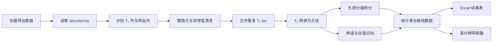

# NMR-Pore-Analyzer v2.1

> 面向低场核磁共振（LF-NMR）T₂ 弛豫谱的孔隙结构分析工具。  
> 本项目围绕水泥基及多孔材料孔结构表征中的数据处理问题，构建了从原始 T₂ 谱读取、孔径转换、孔隙分级、峰谷识别、批量统计到论文图表导出的完整分析流程。  
> 项目目标不是简单绘图，而是将材料微结构表征中的物理假设、数值算法和可复现数据处理过程整合为一个可直接服务科研工作的桌面程序。

---

## 1. 研究背景与问题来源

水泥基材料的孔隙结构与强度发展、离子传输、抗渗性、抗冻性、收缩变形以及长期耐久性密切相关。相比压汞法、氮吸附等传统测试手段，低场核磁共振（Low-field Nuclear Magnetic Resonance，LF-NMR）能够基于孔隙水的横向弛豫时间 T₂，对材料内部孔隙水分布及孔径特征进行无损表征。因此，LF-NMR 已逐渐成为水泥基材料孔结构演化研究中的重要测试方法。

但在实际科研工作中，仪器导出的原始 T₂ 谱往往不能直接用于论文分析。其原因主要包括：

1. 原始数据通常只提供 T₂ 与信号幅值，需要进一步转换为具有材料意义的孔径分布；
2. 不同试样、不同龄期或不同配合比的数据常以多列形式存在，手动处理容易造成重复劳动和统计误差；
3. 孔隙分级阈值、积分方式、峰值识别规则若不统一，会导致不同样品之间缺乏可比性；
4. 高 T₂ 区间的单调尾部容易被误判为第二峰，从而影响主峰/次峰比例、孔结构粗化程度等结论；
5. 科研论文通常需要同时给出原始谱图、累积分布、孔隙分类比例和峰值统计结果，人工整理效率较低且可复现性不足。

基于上述问题，本项目构建了一个面向研究生科研场景的 LF-NMR 孔结构分析工具，旨在将“仪器原始数据”转化为“可用于机理分析和论文表达的定量指标”。

---

## 2. 项目研究目标

本项目的核心目标是建立一套较为规范的 LF-NMR T₂ 谱后处理流程，使孔结构分析过程具有明确的理论依据、稳定的计算规则和可复现的输出结果。

具体目标包括：

| 研究需求 | 本项目实现方式 |
|---|---|
| 原始数据标准化 | 支持 `.xlsx`、`.xls`、`.csv` 文件读取，自动识别 T₂ 列与样品信号列 |
| 孔径定量转换 | 基于表面弛豫理论，将 T₂ 弛豫时间转换为等效孔径 |
| 孔隙结构分级 | 建立物理形态分类与损伤潜势分类两套孔隙划分体系 |
| 孔隙比例计算 | 支持 Bin Summation、Log-domain Integration 与 Linear Integration 三种积分模式 |
| 峰值特征提取 | 实现主峰、次峰、谷值及峰面积比例的自动识别 |
| 批量样品比较 | 对多样品列自动循环分析，便于配合比或龄期对比 |
| 论文结果输出 | 导出 Excel 统计表、累积曲线数据、增量曲线数据和高分辨率图像 |

从研究能力角度看，本项目体现了从材料科学问题出发，进一步完成理论建模、算法实现、软件封装与科研结果输出的完整能力链条。

---

## 3. 理论基础与方法设计

### 3.1 LF-NMR T₂ 弛豫与孔径转换

在饱和多孔材料中，孔隙水的横向弛豫过程主要受体相弛豫、表面弛豫和扩散弛豫共同影响。其基本关系可表示为：

```math
\frac{1}{T_2}
= \frac{1}{T_{2,\text{bulk}}}
+ \rho_2 \cdot \frac{S}{V}
+ \frac{D(\gamma G T_E)^2}{12}
```

其中，`T₂` 为横向弛豫时间，`ρ₂` 为表面弛豫率，`S/V` 为孔隙表面积与体积之比。当测试条件满足短回波间隔、内部磁场梯度影响较小且体相弛豫贡献可忽略时，上式可近似为：

```math
\frac{1}{T_2}
\approx \rho_2 \cdot \frac{S}{V}
= \rho_2 \cdot \frac{F_s}{r}
```

由此可见，T₂ 与孔径 `r` 之间存在近似正相关关系。为了便于水泥基材料孔径区间划分，本项目采用如下标定关系：

```math
T_2 = 4.2\,\text{ms}
\quad \Longleftrightarrow \quad
r = 100\,\text{nm}
```

因此：

```math
r\,[\text{nm}]
= \frac{100}{4.2}T_2\,[\text{ms}]
\approx 23.81T_2
```

该转换系数在 `logic/config.py` 中集中管理，后续可根据不同材料体系、孔隙液性质或表面弛豫率标定结果进行调整。

### 3.2 双体系孔隙分级方法

为了兼顾微观孔结构描述与耐久性评价，本项目设计了两套孔隙分类体系。

#### 3.2.1 System A：物理形态分类

System A 主要用于描述孔隙尺度与微观形态差异。

| 孔隙类型 | T₂ 范围 / ms | 孔径范围 / nm | 物理含义 |
|---|---:|---:|---|
| Gel pores | `[0, 0.42)` | `[0, 10)` | 凝胶孔及细小孔隙 |
| Transition pores | `[0.42, 4.2)` | `[10, 100)` | 过渡孔 |
| Capillary pores | `[4.2, 41.7)` | `[100, 1000)` | 毛细孔 |
| Air-voids | `[41.7, +∞)` | `[1000, +∞)` | 大孔或气孔 |

该分类体系有助于分析胶凝材料组成、养护条件或龄期变化对孔隙细化程度的影响。

#### 3.2.2 System B：损伤潜势分类

System B 更偏向从耐久性和潜在损伤角度解释孔隙结构。

| 孔隙类型 | T₂ 范围 / ms | 孔径范围 / nm | 可能含义 |
|---|---:|---:|---|
| Harmless pores | `[0, 0.83)` | `[0, 20)` | 对传输与损伤影响较小的细孔 |
| Less-harmful pores | `[0.83, 2.08)` | `[20, 50)` | 影响较弱的中小孔 |
| Harmful pores | `[2.08, 8.33)` | `[50, 200)` | 与渗透、劣化过程相关的有害孔 |
| More-harmful pores | `[8.33, +∞)` | `[200, +∞)` | 粗大孔、连通孔或缺陷孔 |

通过两套体系并行输出，可以同时服务“微观结构演化分析”和“耐久性风险讨论”两类论文表达需求。

---

## 4. 数值积分与算法处理

### 4.1 孔隙比例积分方法

仪器导出的 LF-NMR 反演谱通常是离散 T₂ 谱。不同仪器或不同数据处理方式可能导致 T₂ 轴采样特征不同，因此本项目提供三种积分模式。

| 积分模式 | 适用场景 | 计算思想 |
|---|---|---|
| Bin Summation | 推荐默认方式，适用于离散反演谱 | 对区间内信号幅值直接求和 |
| Log-domain Integration | 适用于对数尺度 T₂ 谱的连续曲线近似 | 在 `log10(T₂)` 轴上做梯形积分 |
| Linear Integration | 仅适用于线性 T₂ 采样数据 | 在原始 T₂ 轴上做梯形积分 |

Bin Summation 计算形式为：

```math
S_k = \sum_{i \in k} A_i
```

各孔隙区间比例为：

```math
\phi_k = \frac{|S_k|}{\sum_j |S_j|}
```

对于 Log-domain 与 Linear 积分，程序会在孔隙分类阈值处进行边界插值，避免阈值落在两个采样点之间时造成面积漏算。这一点在多组样品比较中尤其重要，因为小的边界误差可能会被放大为孔隙比例差异。

### 4.2 主峰、次峰与谷值识别

在水泥基材料 T₂ 谱中，主峰通常对应较细孔隙或主要孔隙水分布区间，而高 T₂ 方向出现的次峰可能意味着较粗孔隙、缺陷孔或连通孔比例增加。但并非所有高 T₂ 尾部都应被解释为次峰。因此，本项目采用较为保守的峰值识别规则。

主峰定义为 `[0, 10)` ms 区间内的全局最大值：

```math
i_{pri} = \arg\max_{i:T_{2,i}\in[0,10)} A_i
```

次峰定义为 `(10, 1000]` ms 区间内的严格局部极大值：

```math
A_i > A_{i-1}
\quad \text{and} \quad
A_i > A_{i+1}
```

如果高 T₂ 区域只是单调衰减尾部，程序不会强行输出次峰。这种处理方式可以减少对孔结构粗化的过度解释。

当存在主峰和次峰时，程序进一步在两峰之间寻找严格局部极小值作为分割谷值。若不存在真实局部谷值，则使用 `T₂ = 10 ms` 作为 fallback boundary，并在结果表中标记 `Fallback = Yes`。这样既保证了统计指标可以输出，又保留了对算法假设的透明说明。

---

## 5. 软件结构与实现思路

本项目采用“科学计算逻辑”和“图形界面展示”分离的结构，避免将核心算法直接写入 UI 回调函数中。这样做的好处是：计算过程便于测试，界面逻辑便于维护，后续也更容易扩展为命令行工具或 Web 工具。

```text
NMR-Pore-Analyzer/
├── main.py                    # 程序入口
├── requirements.txt           # 运行依赖
├── requirements-dev.txt       # 测试依赖
├── logic/
│   ├── config.py              # 物理常数、孔隙阈值、列名别名、版本信息
│   ├── analyzer.py            # 数据读取、清洗、孔径转换、孔隙分类
│   ├── peak_processor.py      # 主峰、次峰、谷值识别
│   └── exporter.py            # Excel 科研结果表导出
├── ui/
│   ├── main_window.py         # PySide6 主界面
│   ├── main_window_safe.py    # 线程生命周期安全封装
│   └── plot_canvas.py         # Matplotlib 绘图画布
└── tests/
    ├── conftest.py            # pytest 路径配置
    └── test_core_logic.py     # 核心逻辑测试
```

整体流程如下：



---

## 6. 安装与运行

### 6.1 安装运行依赖

```bash
pip install -r requirements.txt
```

### 6.2 启动程序

```bash
python main.py
```

### 6.3 运行测试

```bash
pip install -r requirements-dev.txt
pytest -q
```

主要依赖包括：

```text
PySide6
numpy
pandas
openpyxl
xlrd
matplotlib
scipy
pytest
```

---

## 7. 输入数据格式

输入文件至少需要包含一列 T₂ 时间轴和一列信号幅值列。若存在多列样品数据，程序会自动对每一列进行批量分析。

示例：

| T2(ms) | Mix-1 | Mix-2 | Mix-3 |
|---:|---:|---:|---:|
| 0.01 | 12.3 | 11.9 | 13.1 |
| 0.02 | 15.6 | 14.8 | 15.2 |
| 0.05 | 18.2 | 17.1 | 19.0 |
| ... | ... | ... | ... |

程序支持常见英文和中文表头识别：

- T₂ 列：`T2`、`T2(ms)`、`T₂(ms)`、`time(ms)`、`relaxation time`、`弛豫时间`、`弛豫时间/ms`；
- 信号列：`amplitude`、`signal`、`intensity`、`dv/dr`、`幅值`、`信号强度`、`孔隙度`、`增量孔隙度`。

支持文件格式：

- `.xlsx`：使用 `openpyxl` 读取；
- `.xls`：使用 `xlrd` 读取；
- `.csv`：优先使用 `utf-8-sig`，失败后自动尝试 `gbk`，适配中文仪器导出文件。

---

## 8. 输出结果

程序导出的 Excel 工作簿包含四张表：

| Sheet | 内容 |
|---|---|
| `Summary_Peak_Statistics` | 主峰、次峰、谷值、主峰/次峰面积比例 |
| `Pore_Classification_Ratios` | System A 与 System B 各类孔隙比例 |
| `Cumulative_Curve_Data` | 各样品孔径-累积分布曲线数据 |
| `Differential_Curve_Data` | 各样品孔径-增量信号分布数据 |

图像支持导出为：

- PNG；
- PDF；
- SVG。

这些结果可直接用于论文图表绘制、配合比对比、龄期演化分析以及微观结构讨论。

---

## 9. 本项目体现的研究能力

本项目虽然体量不大，但覆盖了一个完整的研究型工具开发过程，能够较好体现材料方向研究生在“实验数据理解—理论分析—算法实现—科研表达”方面的综合能力。

### 9.1 材料微结构理解能力

项目以水泥基材料孔结构表征为出发点，将 LF-NMR T₂ 谱与凝胶孔、过渡孔、毛细孔、大孔等微观结构概念建立对应关系，并进一步引入有害孔、无害孔等耐久性讨论维度，使结果不仅停留在数据层面，而是能够服务材料性能机理解释。

### 9.2 理论建模与参数转化能力

项目没有简单把 T₂ 谱作为经验曲线处理，而是基于表面弛豫理论建立 T₂ 与孔径之间的换算关系，并将转换系数、孔隙阈值和分类体系统一配置化。这说明项目关注模型假设、参数来源和后续可校准性。

### 9.3 数值计算与算法严谨性

在孔隙比例计算中，项目区分了离散谱求和、对数域积分和线性域积分，并对积分边界进行插值处理，避免分类阈值处的面积漏算。在峰值识别中，程序采用严格局部极值判断，避免将高 T₂ 单调尾部误判为次峰。这些细节体现了对科研数据处理误差来源的敏感性。

### 9.4 工程实现与可维护性

项目将配置、分析、峰值处理、导出、绘图和界面进行模块化拆分，并补充了核心逻辑测试。相比单文件脚本，这种结构更接近可维护的科研软件，也便于后续继续扩展为命令行批处理、Web 应用或与机器学习模型联动的数据处理模块。

### 9.5 可复现科研表达能力

程序将关键假设、处理流程、分类阈值和输出格式显式化，减少了手工处理中的主观差异。导出的 Excel 表和图像能够直接进入论文结果分析环节，有助于形成从实验数据到论文图表的可追溯流程。

---

## 10. 适用场景

本项目适用于以下研究任务：

1. 水泥浆体、砂浆、混凝土、ECC 等水泥基材料的 LF-NMR 孔结构分析；
2. 不同胶凝材料组成、养护制度或龄期条件下的孔隙演化比较；
3. 孔径分布、累积分布和孔隙分类比例的批量统计；
4. 主峰/次峰变化与孔结构粗化、孔隙连通性或缺陷孔形成之间的关系分析；
5. 毕业论文、科研报告或论文初稿中的孔结构结果整理。

---

## 11. 假设条件与局限性

为了保证分析结论具有边界感，本项目明确列出以下假设：

1. 默认采用 `4.2 ms ↔ 100 nm` 的标定关系，不同材料体系应结合实际表面弛豫率进行校准；
2. 程序默认保留正 T₂ 与正信号幅值，NaN 和非正值会在清洗阶段删除；
3. 对大多数 LF-NMR 仪器反演谱，推荐使用 Bin Summation；Linear Integration 仅适用于线性采样 T₂ 轴；
4. 峰值分割是一种定量描述方法，不应脱离原始谱图、配合比、养护条件和其他微观测试结果单独解释；
5. 本工具强调透明、可复现和可审查，不替代研究者对材料机理的判断。

---

## 12. 版本说明

当前版本：`v2.1.0`

主要更新：

- 支持 `.xlsx`、`.xls`、`.csv` 数据文件；
- 增强中英文表头自动识别；
- 合并重复 T₂ bin，提高积分稳定性；
- 修正 Log / Linear 积分中的边界插值问题；
- 修正次峰误判问题，避免将单调尾部识别为次峰；
- 修正谷值识别逻辑，并显式标记 fallback valley；
- 导出四张科研结果表；
- 增加 PySide6 线程生命周期保护；
- 增加 pytest 核心逻辑测试。

---

## 13. 项目定位说明

NMR-Pore-Analyzer 是一个面向研究生科研工作的 LF-NMR 数据分析项目。它的重点不在于界面复杂度，而在于将材料微结构表征中的理论假设、数值方法、算法规则和结果表达整合为一个稳定、透明、可复现的分析流程。

对于个人科研能力展示而言，本项目能够体现：对材料实验数据的理解能力、将理论模型转化为计算方法的能力、对数据处理误差的辨识能力、以及将科研流程工程化实现的能力。
